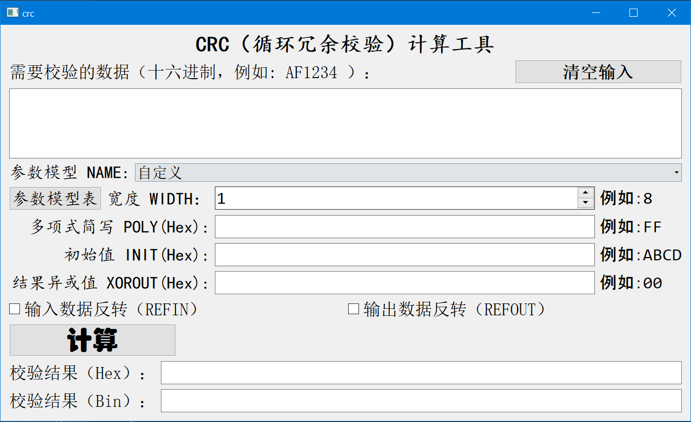
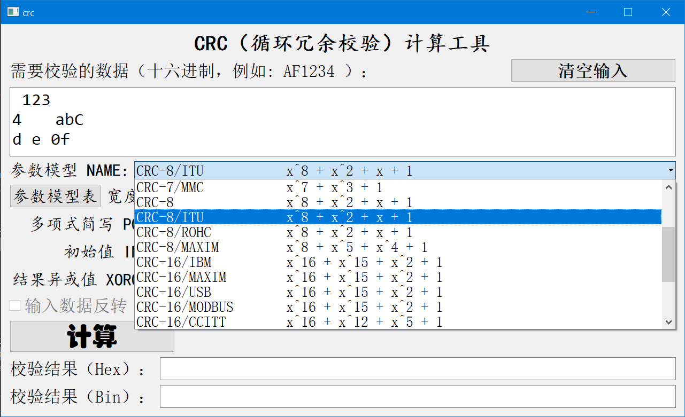
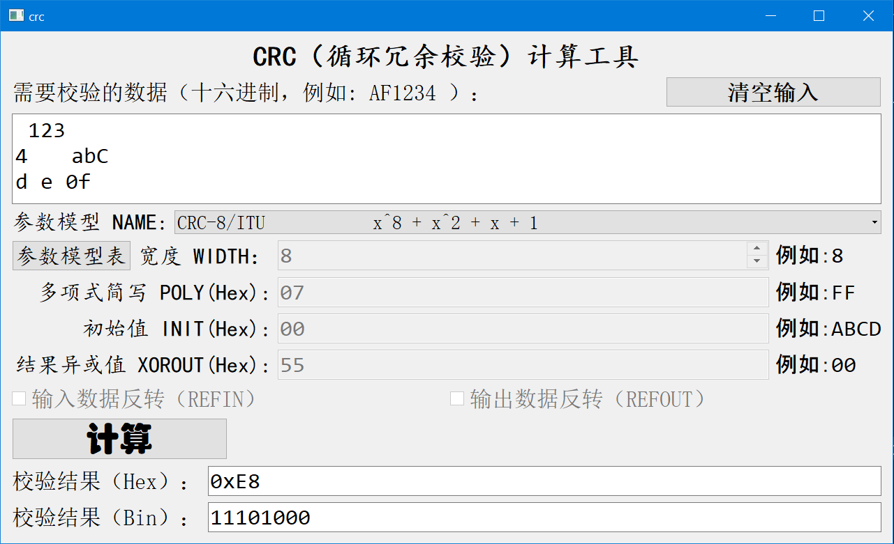
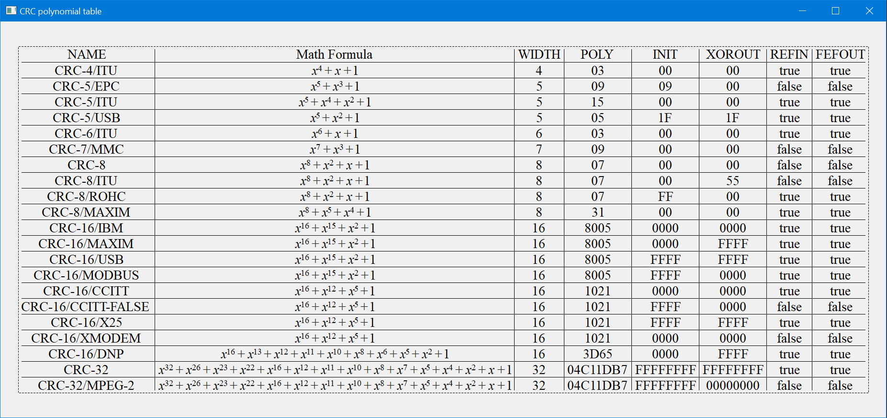
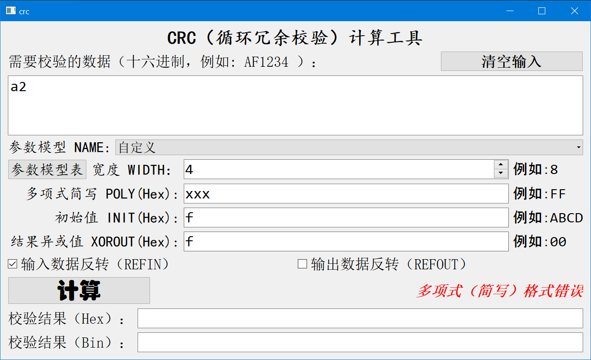

# CRC_tools

CRC tool(include 21 polynomials and custom).

WIKI:[Cyclic redundancy check - Wikipedia](https://en.wikipedia.org/wiki/Cyclic_redundancy_check)

## 使用说明

- 点击 `CRC.exe`运行，因为是静态编译所以可直接拷贝exe文件到别的系统使用。
- 输入十六进制数据。
- 
- 选择参数模型。
- 
- 计算。
- 
- 可以查看参数模型表。
- 
- 有输入的格式校验和提示信息。
- 

## CRC介绍

- CRC的全称是循环冗余校验（Cyclic Redundancy Check）。CRC的目的是**保证数据的完整性**，其方法是在发送数据的后面再增加多余的若干位数据（CRC的校验码）。
- **CRC校验本质上是选取一个合适的除数，要进行校验的数据是被除数，然后做模2除法（异或），得到的余数就是CRC校验值。**
- 那么这里的选取一个合适的除数，通常我们把选取的除数称之为“**生成多项式**”，生成多项式的选取是由一定标准的，如果选的不好，那么检出错误的概率就会低很多。
- 如何使得生成多项式更好的检测数据出错，这个问题已经被很多大佬研究得很成熟，我们只需要拿着用就好了。
- 一个完整的CRC参数模型应该包含以下信息：`WIDTH`，`POLY`，`INIT`，`REFIN`，`REFOUT`，`XOROUT`。
- 开始使用参数模型要知道的一些概念：

  - `NAME`：参数模型名称。
  - `WIDTH`：宽度，即生成的CRC数据位宽（CRC的比特数），如CRC-8，生成的CRC为8位
  - `POLY`：十六进制多项式。例如：CRC-8的多项式为

    $$
    x^8 + x^2 + x + 1
    $$

    十六进制代码为：`0x07`，忽略了最高位的"1"，即完整的生成项是 `0x107`。
  - `INIT`：CRC初始值，和WIDTH位宽长度一致。

    - 初始值是给CRC计算一个**初始值**，可以是0，也可以是其他值。初始值是与原始数据的最高位对齐后异或，例如：
    - ```c
      0101 0101 0101 0101 //原始数据
      xor
      1111 1111			//INIT
      ```
  - `REFIN`：true或false

    - 表示在进行计算之前，原始数据是否**按照字节**翻转，如原始数据：`0x34 = 0011 0100`，如果REFIN为true，进行翻转之后为 `0010 1100 = 0x2c`
    - 举个长数据的例子：
    - ```c
      1010 1100   1100 1100   1101 1011 //原始数据0xACCCDB
      //按照字节翻转:
      0011 0101   0011 0011   1101 1011 //反转之后的数据
      ```
    - 注意是按照**字节**翻转。
  - `REFOUT`：true或false

    - 运算完成之后，得到的CRC值是否进行**整体**翻转，如计算得到的CRC值：`0x97 = 1001 0111`，如果REFOUT为true，进行翻转之后为 `11101001 = 0xE9`。
    - 同样举个长数据的例子：
    - ```c
      1010 1100 1100 1100 1101 1011 //原始计算得出的crc数据0xACCCDB
      //整体翻转
      1101 1011 0011 0011 0011 0101 //最终结果
      ```
    - 注意是**整体**翻转。
  - `XOROUT`：计算结果与此参数进行异或运算后得到最终的CRC值，和WIDTH位宽一致。结果异或值是把计算结果再异或某一个值；这么做的目的是**防止全0数据的CRC一直为0**。
- 输入数据反转是指输入数据以**字节**为单位按位逆序处理；输出数据反转是指CRC计算结果**整体**按位逆序处理；一个合理解释是右移比左移更容易计算，效率高，它跟大小端无关。
- 通常如果只给了一个多项式，其他的没有说明则：`INIT = 0x00`，`REFIN = false`，`REFOUT = false`，`XOROUT = 0x00`。

## 常见CRC参数模型

|        NAME        |                                         多项式公式                                         | 宽度 | 多项式16进制值 |  初始值  | 结果异或值 | 输入反转 | 输出反转 |
| :----------------: | :-----------------------------------------------------------------------------------------: | :--: | :------------: | :------: | :--------: | :------: | :------: |
|     CRC-4/ITU     |                                         x^4 + x + 1                                         |  4  |       03       |    00    |     00     |   true   |   true   |
|     CRC-5/EPC     |                                        x^5 + x^3 + 1                                        |  5  |       09       |    09    |     00     |  false  |  false  |
|     CRC-5/ITU     |                                     x^5 + x^4 + x^2 + 1                                     |  5  |       15       |    00    |     00     |   true   |   true   |
|     CRC-5/USB     |                                        x^5 + x^2 + 1                                        |  5  |       05       |    1F    |     1F     |   true   |   true   |
|     CRC-6/ITU     |                                         x^6 + x + 1                                         |  6  |       03       |    00    |     00     |   true   |   true   |
|     CRC-7/MMC     |                                        x^7 + x^3 + 1                                        |  7  |       09       |    00    |     00     |  false  |  false  |
|       CRC-8       |                                      x^8 + x^2 + x + 1                                      |  8  |       07       |    00    |     00     |  false  |  false  |
|     CRC-8/ITU     |                                      x^8 + x^2 + x + 1                                      |  8  |       07       |    00    |     55     |  false  |  false  |
|     CRC-8/ROHC     |                                      x^8 + x^2 + x + 1                                      |  8  |       07       |    FF    |     00     |   true   |   true   |
|    CRC-8/MAXIM    |                                     x^8 + x^5 + x^4 + 1                                     |  8  |       31       |    00    |     00     |   true   |   true   |
|     CRC-16/IBM     |                                    x^16 + x^15 + x^2 + 1                                    |  16  |      8005      |   0000   |    0000    |   true   |   true   |
|    CRC-16/MAXIM    |                                    x^16 + x^15 + x^2 + 1                                    |  16  |      8005      |   0000   |    FFFF    |   true   |   true   |
|     CRC-16/USB     |                                    x^16 + x^15 + x^2 + 1                                    |  16  |      8005      |   FFFF   |    FFFF    |   true   |   true   |
|   CRC-16/MODBUS   |                                    x^16 + x^15 + x^2 + 1                                    |  16  |      8005      |   FFFF   |    0000    |   true   |   true   |
|    CRC-16/CCITT    |                                    x^16 + x^12 + x^5 + 1                                    |  16  |      1021      |   0000   |    0000    |   true   |   true   |
| CRC-16/CCITT-FALSE |                                    x^16 + x^12 + x^5 + 1                                    |  16  |      1021      |   FFFF   |    0000    |  false  |  false  |
|     CRC-16/X25     |                                    x^16 + x^12 + x^5 + 1                                    |  16  |      1021      |   FFFF   |    FFFF    |   true   |   true   |
|   CRC-16/XMODEM   |                                    x^16 + x^12 + x^5 + 1                                    |  16  |      1021      |   0000   |    0000    |  false  |  false  |
|     CRC-16/DNP     |                x^16 + x^13 + x^12 + x^11 + x^10 + x^8 + x^6 + x^5 + x^2 + 1                |  16  |      3D65      |   0000   |    FFFF    |   true   |   true   |
|       CRC-32       | x^32 + x^26 + x^23 + x^22 + x^16 + x^12 + x^11 + x^10 + x^8 + x^7 + x^5 + x^4 + x^2 + x + 1 |  32  |    04C11DB7    | FFFFFFFF |  FFFFFFFF  |   true   |   true   |
|   CRC-32/MPEG-2   | x^32 + x^26 + x^23 + x^22 + x^16 + x^12 + x^11 + x^10 + x^8 + x^7 + x^5 + x^4 + x^2 + x + 1 |  32  |    04C11DB7    | FFFFFFFF |  00000000  |  false  |  false  |

## 手算示例

例如数据串：`3C6D`

- 参数模型NAME：`CRC-8`
- 位宽WIDTH：`8`
- 多项式POLY：十六进制表示：`0x107`

  $$
  x^8 + x^2 + x + 1
  $$
- 初始值INIT：`0x00`
- 结果异或值XOROUT：`0x00`
- 输入反转：`false`
- 输出反转：`false`

步骤：

1. 列出除数和被除数，这里输入数据反转是false，所以输入数据还是原数据：`3C6D`(先输入反转再计算)

   - 除数：`1 0000 0111`(二进制)
   - 被除数：`0011 1100 0110 1101`(前面补上0)
2. 数据后面补0，补0的数量和位宽一致，这里补8个0

   - `0011 1100 0110 1101 0000 0000`
3. 把数据和初始值INIT异或，注意左对齐，这里只需要异或前8位。

   - $$
     XOR \quad\frac{0011\quad1100\quad0110\quad1101\quad0000\quad0000}{0000\quad0000\quad\quad\quad\quad\quad\quad\quad\quad\quad\quad\quad\quad}
     $$
   - 结果不变：`0011 1100 0110 1101 0000 0000`
4. 接下来左对齐然后和除数异或，如果数据左边为0，则除数向右移动一位。

   - 这里向右移动两位
   - <table border="0" cellpadding="0" cellspacing="0" width="768" style="border-collapse:collapse;table-layout:fixed;">
         <colgroup>
             <col width="32" span="24" style="width:24pt">
         </colgroup>
         <tbody align="center">
             <tr height="32" style="mso-height-source:userset;height:24.0pt">
                 <td height="32" width="32" style="height:24.0pt;width:24pt">0</td>
                 <td width="32" style="width:24pt">0</td>
                 <td width="32" style="width:24pt">1</td>
                 <td width="32" style="width:24pt">1</td>
                 <td width="32" style="width:24pt">1</td>
                 <td width="32" style="width:24pt">1</td>
                 <td width="32" style="width:24pt">0</td>
                 <td width="32" style="width:24pt">0</td>
                 <td width="32" style="width:24pt">0</td>
                 <td width="32" style="width:24pt">1</td>
                 <td width="32" style="width:24pt">1</td>
                 <td width="32" style="width:24pt">0</td>
                 <td width="32" style="width:24pt">1</td>
                 <td width="32" style="width:24pt">1</td>
                 <td width="32" style="width:24pt">0</td>
                 <td width="32" style="width:24pt">1</td>
                 <td width="32" style="width:24pt">0</td>
                 <td width="32" style="width:24pt">0</td>
                 <td width="32" style="width:24pt">0</td>
                 <td width="32" style="width:24pt">0</td>
                 <td width="32" style="width:24pt">0</td>
                 <td width="32" style="width:24pt">0</td>
                 <td width="32" style="width:24pt">0</td>
                 <td width="32" style="width:24pt">0</td>
             </tr>
             <tr height="32" style="mso-height-source:userset;height:24.0pt">
                 <td height="32" style="height:24.0pt"></td>
                 <td></td>
                 <td>1</td>
                 <td>0</td>
                 <td>0</td>
                 <td>0</td>
                 <td>0</td>
                 <td>0</td>
                 <td>1</td>
                 <td>1</td>
                 <td>1</td>
                 <td rowspan="2" class="xl66">↓</td>
                 <td rowspan="5" class="xl69" width="32" style="width:24pt">↓</td>
                 <td rowspan="8" class="xl69" width="32" style="width:24pt">↓</td>
                 <td colspan="3" rowspan="11" class="xl69" width="96" style="width:72pt">↓</td>
                 <td rowspan="14" class="xl69" width="32" style="width:24pt">↓</td>
                 <td colspan="2" rowspan="17" class="xl66">↓</td>
                 <td rowspan="20" class="xl66">↓</td>
                 <td colspan="2" rowspan="23" class="xl66">↓</td>
                 <td rowspan="26" class="xl66">↓</td>
             </tr>
             <tr height="32" style="mso-height-source:userset;height:24.0pt">
                 <td height="32" class="xl67" style="height:24.0pt"></td>
                 <td class="xl68"></td>
                 <td colspan="9" class="xl66">第一次异或↓</td>
             </tr>
             <tr height="32" style="mso-height-source:userset;height:24.0pt">
                 <td height="32" style="height:24.0pt"></td>
                 <td></td>
                 <td>0</td>
                 <td>1</td>
                 <td>1</td>
                 <td>1</td>
                 <td>0</td>
                 <td>0</td>
                 <td>1</td>
                 <td>0</td>
                 <td>0</td>
                 <td>0</td>
             </tr>
             <tr height="32" style="mso-height-source:userset;height:24.0pt">
                 <td height="32" style="height:24.0pt"></td>
                 <td></td>
                 <td></td>
                 <td>1</td>
                 <td>0</td>
                 <td>0</td>
                 <td>0</td>
                 <td>0</td>
                 <td>0</td>
                 <td>1</td>
                 <td>1</td>
                 <td>1</td>
             </tr>
             <tr height="32" style="mso-height-source:userset;height:24.0pt">
                 <td height="32" style="height:24.0pt"></td>
                 <td></td>
                 <td></td>
                 <td colspan="9" class="xl66">第二次异或↓</td>
             </tr>
             <tr height="32" style="mso-height-source:userset;height:24.0pt">
                 <td height="32" style="height:24.0pt"></td>
                 <td></td>
                 <td></td>
                 <td>0</td>
                 <td>1</td>
                 <td>1</td>
                 <td>0</td>
                 <td>0</td>
                 <td>1</td>
                 <td>1</td>
                 <td>1</td>
                 <td>1</td>
                 <td>1</td>
             </tr>
             <tr height="32" style="mso-height-source:userset;height:24.0pt">
                 <td height="32" style="height:24.0pt"></td>
                 <td></td>
                 <td></td>
                 <td></td>
                 <td>1</td>
                 <td>0</td>
                 <td>0</td>
                 <td>0</td>
                 <td>0</td>
                 <td>0</td>
                 <td>1</td>
                 <td>1</td>
                 <td>1</td>
             </tr>
             <tr height="32" style="mso-height-source:userset;height:24.0pt">
                 <td height="32" style="height:24.0pt"></td>
                 <td></td>
                 <td></td>
                 <td></td>
                 <td colspan="9" class="xl66">第三次异或↓</td>
             </tr>
             <tr height="32" style="mso-height-source:userset;height:24.0pt">
                 <td height="32" style="height:24.0pt"></td>
                 <td></td>
                 <td></td>
                 <td></td>
                 <td>0</td>
                 <td>1</td>
                 <td>0</td>
                 <td>0</td>
                 <td>1</td>
                 <td>1</td>
                 <td>0</td>
                 <td>0</td>
                 <td>0</td>
                 <td>1</td>
             </tr>
             <tr height="32" style="mso-height-source:userset;height:24.0pt">
                 <td height="32" style="height:24.0pt"></td>
                 <td></td>
                 <td></td>
                 <td></td>
                 <td></td>
                 <td>1</td>
                 <td>0</td>
                 <td>0</td>
                 <td>0</td>
                 <td>0</td>
                 <td>0</td>
                 <td>1</td>
                 <td>1</td>
                 <td>1</td>
             </tr>
             <tr height="32" style="mso-height-source:userset;height:24.0pt">
                 <td height="32" style="height:24.0pt"></td>
                 <td></td>
                 <td></td>
                 <td></td>
                 <td></td>
                 <td colspan="9" class="xl66">第四次异或↓</td>
             </tr>
             <tr height="32" style="mso-height-source:userset;height:24.0pt">
                 <td height="32" style="height:24.0pt"></td>
                 <td></td>
                 <td></td>
                 <td></td>
                 <td></td>
                 <td>0</td>
                 <td>0</td>
                 <td>0</td>
                 <td>1</td>
                 <td>1</td>
                 <td>0</td>
                 <td>1</td>
                 <td>1</td>
                 <td>0</td>
                 <td>0</td>
                 <td>1</td>
                 <td>0</td>
             </tr>
             <tr height="32" style="mso-height-source:userset;height:24.0pt">
                 <td height="32" style="height:24.0pt"></td>
                 <td></td>
                 <td></td>
                 <td></td>
                 <td></td>
                 <td></td>
                 <td></td>
                 <td></td>
                 <td>1</td>
                 <td>0</td>
                 <td>0</td>
                 <td>0</td>
                 <td>0</td>
                 <td>0</td>
                 <td>1</td>
                 <td>1</td>
                 <td>1</td>
             </tr>
             <tr height="32" style="mso-height-source:userset;height:24.0pt">
                 <td height="32" style="height:24.0pt"></td>
                 <td></td>
                 <td></td>
                 <td></td>
                 <td></td>
                 <td></td>
                 <td></td>
                 <td></td>
                 <td colspan="9" class="xl66">第五次异或↓</td>
             </tr>
             <tr height="32" style="mso-height-source:userset;height:24.0pt">
                 <td height="32" style="height:24.0pt"></td>
                 <td></td>
                 <td></td>
                 <td></td>
                 <td></td>
                 <td></td>
                 <td></td>
                 <td></td>
                 <td>0</td>
                 <td>1</td>
                 <td>0</td>
                 <td>1</td>
                 <td>1</td>
                 <td>0</td>
                 <td>1</td>
                 <td>0</td>
                 <td>1</td>
                 <td>0</td>
             </tr>
             <tr height="32" style="mso-height-source:userset;height:24.0pt">
                 <td height="32" style="height:24.0pt"></td>
                 <td></td>
                 <td></td>
                 <td></td>
                 <td></td>
                 <td></td>
                 <td></td>
                 <td></td>
                 <td></td>
                 <td>1</td>
                 <td>0</td>
                 <td>0</td>
                 <td>0</td>
                 <td>0</td>
                 <td>0</td>
                 <td>1</td>
                 <td>1</td>
                 <td>1</td>
             </tr>
             <tr height="32" style="mso-height-source:userset;height:24.0pt">
                 <td height="32" style="height:24.0pt"></td>
                 <td></td>
                 <td></td>
                 <td></td>
                 <td></td>
                 <td></td>
                 <td></td>
                 <td></td>
                 <td></td>
                 <td colspan="9" class="xl66">第六次异或↓</td>
             </tr>
             <tr height="32" style="mso-height-source:userset;height:24.0pt">
                 <td height="32" style="height:24.0pt"></td>
                 <td></td>
                 <td></td>
                 <td></td>
                 <td></td>
                 <td></td>
                 <td></td>
                 <td></td>
                 <td></td>
                 <td>0</td>
                 <td>0</td>
                 <td>1</td>
                 <td>1</td>
                 <td>0</td>
                 <td>1</td>
                 <td>1</td>
                 <td>0</td>
                 <td>1</td>
                 <td>0</td>
                 <td>0</td>
             </tr>
             <tr height="32" style="mso-height-source:userset;height:24.0pt">
                 <td height="32" style="height:24.0pt"></td>
                 <td></td>
                 <td></td>
                 <td></td>
                 <td></td>
                 <td></td>
                 <td></td>
                 <td></td>
                 <td></td>
                 <td></td>
                 <td></td>
                 <td>1</td>
                 <td>0</td>
                 <td>0</td>
                 <td>0</td>
                 <td>0</td>
                 <td>0</td>
                 <td>1</td>
                 <td>1</td>
                 <td>1</td>
             </tr>
             <tr height="32" style="mso-height-source:userset;height:24.0pt">
                 <td height="32" style="height:24.0pt"></td>
                 <td></td>
                 <td></td>
                 <td></td>
                 <td></td>
                 <td></td>
                 <td></td>
                 <td></td>
                 <td></td>
                 <td></td>
                 <td></td>
                 <td colspan="9" class="xl66">第七次异或↓</td>
             </tr>
             <tr height="32" style="mso-height-source:userset;height:24.0pt">
                 <td height="32" style="height:24.0pt"></td>
                 <td></td>
                 <td></td>
                 <td></td>
                 <td></td>
                 <td></td>
                 <td></td>
                 <td></td>
                 <td></td>
                 <td></td>
                 <td></td>
                 <td>0</td>
                 <td>1</td>
                 <td>0</td>
                 <td>1</td>
                 <td>1</td>
                 <td>0</td>
                 <td>0</td>
                 <td>1</td>
                 <td>1</td>
                 <td>0</td>
             </tr>
             <tr height="32" style="mso-height-source:userset;height:24.0pt">
                 <td height="32" style="height:24.0pt"></td>
                 <td></td>
                 <td></td>
                 <td></td>
                 <td></td>
                 <td></td>
                 <td></td>
                 <td></td>
                 <td></td>
                 <td></td>
                 <td></td>
                 <td></td>
                 <td>1</td>
                 <td>0</td>
                 <td>0</td>
                 <td>0</td>
                 <td>0</td>
                 <td>0</td>
                 <td>1</td>
                 <td>1</td>
                 <td>1</td>
             </tr>
             <tr height="32" style="mso-height-source:userset;height:24.0pt">
                 <td height="32" style="height:24.0pt"></td>
                 <td></td>
                 <td></td>
                 <td></td>
                 <td></td>
                 <td></td>
                 <td></td>
                 <td></td>
                 <td></td>
                 <td></td>
                 <td></td>
                 <td></td>
                 <td colspan="9" class="xl66">第八次异或↓</td>
             </tr>
             <tr height="32" style="mso-height-source:userset;height:24.0pt">
                 <td height="32" style="height:24.0pt"></td>
                 <td></td>
                 <td></td>
                 <td></td>
                 <td></td>
                 <td></td>
                 <td></td>
                 <td></td>
                 <td></td>
                 <td></td>
                 <td></td>
                 <td></td>
                 <td>0</td>
                 <td>0</td>
                 <td>1</td>
                 <td>1</td>
                 <td>0</td>
                 <td>0</td>
                 <td>0</td>
                 <td>0</td>
                 <td>1</td>
                 <td>0</td>
                 <td>0</td>
             </tr>
             <tr height="32" style="mso-height-source:userset;height:24.0pt">
                 <td height="32" style="height:24.0pt"></td>
                 <td></td>
                 <td></td>
                 <td></td>
                 <td></td>
                 <td></td>
                 <td></td>
                 <td></td>
                 <td></td>
                 <td></td>
                 <td></td>
                 <td></td>
                 <td></td>
                 <td></td>
                 <td>1</td>
                 <td>0</td>
                 <td>0</td>
                 <td>0</td>
                 <td>0</td>
                 <td>0</td>
                 <td>1</td>
                 <td>1</td>
                 <td>1</td>
             </tr>
             <tr height="32" style="mso-height-source:userset;height:24.0pt">
                 <td height="32" style="height:24.0pt"></td>
                 <td></td>
                 <td></td>
                 <td></td>
                 <td></td>
                 <td></td>
                 <td></td>
                 <td></td>
                 <td></td>
                 <td></td>
                 <td></td>
                 <td></td>
                 <td></td>
                 <td></td>
                 <td colspan="9" class="xl66">第九次异或↓</td>
             </tr>
             <tr height="32" style="mso-height-source:userset;height:24.0pt">
                 <td height="32" style="height:24.0pt"></td>
                 <td></td>
                 <td></td>
                 <td></td>
                 <td></td>
                 <td></td>
                 <td></td>
                 <td></td>
                 <td></td>
                 <td></td>
                 <td></td>
                 <td></td>
                 <td></td>
                 <td></td>
                 <td>0</td>
                 <td>1</td>
                 <td>0</td>
                 <td>0</td>
                 <td>0</td>
                 <td>0</td>
                 <td>0</td>
                 <td>1</td>
                 <td>1</td>
                 <td>0</td>
             </tr>
             <tr height="32" style="mso-height-source:userset;height:24.0pt">
                 <td height="32" style="height:24.0pt"></td>
                 <td></td>
                 <td></td>
                 <td></td>
                 <td></td>
                 <td></td>
                 <td></td>
                 <td></td>
                 <td></td>
                 <td></td>
                 <td></td>
                 <td></td>
                 <td></td>
                 <td></td>
                 <td></td>
                 <td>1</td>
                 <td>0</td>
                 <td>0</td>
                 <td>0</td>
                 <td>0</td>
                 <td>0</td>
                 <td>1</td>
                 <td>1</td>
                 <td>1</td>
             </tr>
             <tr height="32" style="mso-height-source:userset;height:24.0pt">
                 <td height="32" style="height:24.0pt"></td>
                 <td></td>
                 <td></td>
                 <td></td>
                 <td></td>
                 <td></td>
                 <td></td>
                 <td></td>
                 <td></td>
                 <td></td>
                 <td></td>
                 <td></td>
                 <td></td>
                 <td></td>
                 <td></td>
                 <td colspan="9" class="xl66">第十次异或↓（结果）</td>
             </tr>
             <tr height="32" style="mso-height-source:userset;height:24.0pt">
                 <td height="32" style="height:24.0pt"></td>
                 <td></td>
                 <td></td>
                 <td></td>
                 <td></td>
                 <td></td>
                 <td></td>
                 <td></td>
                 <td></td>
                 <td></td>
                 <td></td>
                 <td></td>
                 <td></td>
                 <td></td>
                 <td></td>
                 <td>0</td>
                 <td>0</td>
                 <td>0</td>
                 <td>0</td>
                 <td>0</td>
                 <td>0</td>
                 <td>0</td>
                 <td>0</td>
                 <td>1</td>
             </tr>
             <!--[if supportMisalignedColumns]-->
             <tr height="0" style="display:none">
                 <td width="32" style="width:24pt"></td>
                 <td width="32" style="width:24pt"></td>
                 <td width="32" style="width:24pt"></td>
                 <td width="32" style="width:24pt"></td>
                 <td width="32" style="width:24pt"></td>
                 <td width="32" style="width:24pt"></td>
                 <td width="32" style="width:24pt"></td>
                 <td width="32" style="width:24pt"></td>
                 <td width="32" style="width:24pt"></td>
                 <td width="32" style="width:24pt"></td>
                 <td width="32" style="width:24pt"></td>
                 <td width="32" style="width:24pt"></td>
                 <td width="32" style="width:24pt"></td>
                 <td width="32" style="width:24pt"></td>
                 <td width="32" style="width:24pt"></td>
                 <td width="32" style="width:24pt"></td>
                 <td width="32" style="width:24pt"></td>
                 <td width="32" style="width:24pt"></td>
                 <td width="32" style="width:24pt"></td>
                 <td width="32" style="width:24pt"></td>
                 <td width="32" style="width:24pt"></td>
                 <td width="32" style="width:24pt"></td>
                 <td width="32" style="width:24pt"></td>
                 <td width="32" style="width:24pt"></td>
             </tr>
             <!--[endif]-->
         </tbody>
     </table>
   - 注意的是：**再在每一次异或之前，需要检查前面是否有0，如果有0则向后移动直到下一位为1**
   - 一直重复异或步骤，直到要异或的数据小于除数的长度停止循环。
5. 数据输出反转flag为 `false`，该数据不需要反转处理。
6. 把最后的结果和结果异或值 `XOROUT`异或处理，这里与 `0x00`异或，相当于没处理。（**注意，先输出反转再结果异或**）
7. 最终结果为：`00000001`(binary) `0x01`(hexadecimal)，**注意输出结果的位数和位宽 `WIDTH`一致。**

## 在线CRC工具：

* [CRC在线计算 (lddgo.net)](https://www.lddgo.net/encrypt/crc)
* [CRC（循环冗余校验）在线计算_ip33.com](http://www.ip33.com/crc.html)
